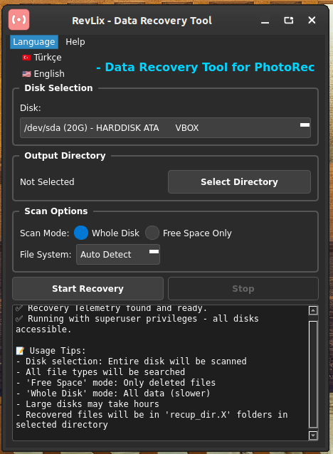
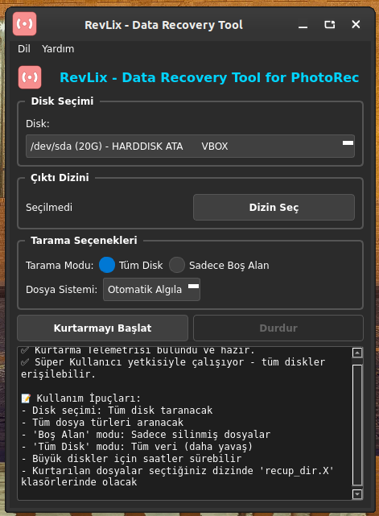

<a href="#">
    
</a>

# RevLix (Recovery Linux) - Data Recovery
RevLix is a powerful data recovery tool developed to recover deleted files on Linux systems. This program uses the PhotoRec infrastructure and provides a graphical user interface (GUI) for PhotoRec.


**Note:** Special thanks to [A. Serhet KILIÇOĞLU (Shampuan)](https://github.com/shampuan) for his significant contributions to the development and design.


<h1 align="center">RevLix Logo</h1>

<p align="center">
  
</p>

----------------------------------

# Linux Screenshot
  
  
--------------------

# To install directly on Linux


Linux (based debian) Terminal: Linux (debian based distributions) To install directly from Terminal.
```bash
wget -O Setup_Linux64.deb https://github.com/cektor/RevLix/releases/download/1.0.0/Setup_Linux64.deb && sudo apt install ./Setup_Linux64.deb && sudo apt-get install -f -y
```


Release Page: https://github.com/cektor/RevLix/releases/tag/1.0.0
